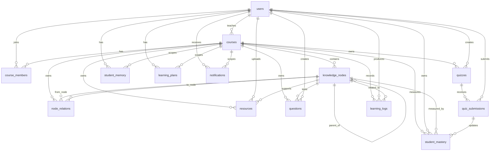

------------

------------

# 数据库设计（Database Schema）

按 MVP 阶段 15 张核心表定稿。本文档用于指导 Spring Entity/MyBatis Mapper 与 Flyway `V1__init.sql` 编写；若后续扩展题目选项表、测验题目关联表、周报表、Agent 任务表等，另起 V2 迁移。

| 项目 | 填写 |
|------|------|
| **文档版本** | v0.2 |
| **状态** | ☐ 草稿 / ☒ 待评审 / ☐ 已冻结 |
| **主责** | Dev 3（表结构、迁移脚本） |
| **协作** | Dev 4（学情/掌握度相关表与索引）；Dev 5（确认 `student_memory`、`notifications` 字段满足 Agent） |
| **评审人** | Dev 3 + Dev 4 + Dev 5（Agent 相关表） |
| **目标完成** | Day 2 EOD（与 PRD 里程碑一致） |
| **可执行产物** | 本文档定稿后生成 Flyway `backend/src/main/resources/db/migration/V1__init.sql` |

---

## 1. 文档说明

### 1.1 本文档做什么

定义 MVP 阶段 **PostgreSQL** 的完整表结构，作为 Spring JPA/MyBatis Entity、Mapper、迁移脚本与 Seed 脚本的**唯一依据**。

### 1.2 填写前先读

| 文档 | 关注内容 |
|------|----------|
| [product/PRD-v0.2.md](../product/PRD-v0.2.md) §6 | 表名与字段草案 |
| [api-spec.md](../api-spec.md) | 接口 JSON 字段名、枚举值（须与表字段一致） |
| [architecture.md](../architecture.md) §9 | ER 关系、数据分层（事实源 vs AI 摘要） |
| [spec-alignment-notes.md](../spec-alignment-notes.md) §2、§3 | 记忆 `course_id`、`memory_json` 等已定决策 |
| [demo-seed-spec.md](../demo-seed-spec.md) | Seed 账号 ID、演示课程与掌握度样例 |
| [tech-setup.md](../tech-setup.md) §1.1 | `student_memory` DDL 示例 |

### 1.3 与 backend-module.md 的关系

- **database-schema.md**：只写**数据层**（表、字段、约束、索引）。
- **backend-module.md**：写 Spring 包结构、Service 逻辑；可引用本文档，不重复贴全量 DDL。

---

## 2. 技术约定

| 项 | 建议值 | 实际采用 |
|----|--------|----------|
| 数据库 | PostgreSQL 15 | PostgreSQL 15 |
| 字符集 | UTF-8 | UTF-8 |
| 主键策略 | BIGSERIAL / UUID（二选一，注明） | BIGSERIAL；Seed 可显式插入固定 ID |
| 时间字段 | TIMESTAMP WITH TIME ZONE / TIMESTAMP | TIMESTAMP WITH TIME ZONE（简称 `TIMESTAMPTZ`） |
| JSON 字段 | JSONB（推荐）/ TEXT | JSONB |
| 命名风格 | snake_case 表名与列名 | snake_case |
| 迁移工具 | Flyway / 纯 schema.sql | Flyway，首版 `V1__init.sql` |
| 软删除 | MVP 不做 / 部分表做 | MVP 不做统一软删除；业务状态用 `status` / `is_read` |

---

## 3. ER 关系图

**填写 Checklist**

- [x] 所有外键关系已标注。
- [x] `course_members.user_id` 统一表示课程成员，`member_role` 表示其在课程内身份；`users.role` 表示系统主身份。成员角色与系统角色的一致性由业务层校验。
- [x] `student_mastery` 唯一约束 `(student_id, node_id, course_id)` 已体现。

---

## 4. 枚举与字典

枚举采用 `VARCHAR + CHECK` 实现，便于 Java 侧用 enum 映射；如后续枚举频繁扩展，可改为字典表。

| 枚举名 | 用于表.字段 | 取值 | 备注 |
|--------|-------------|------|------|
| user_role | users.role | TEACHER, STUDENT, ADMIN | MVP 保留 ADMIN，后台可暂不开放 |
| user_status | users.status | ACTIVE, DISABLED | |
| course_status | courses.status | DRAFT, ACTIVE, ARCHIVED | |
| course_member_role | course_members.member_role | TEACHER, ASSISTANT, STUDENT | 课程内身份 |
| course_member_status | course_members.status | ACTIVE, REMOVED | |
| node_status | knowledge_nodes.status | ACTIVE, HIDDEN | |
| node_relation_type | node_relations.type | PREREQUISITE, DEPENDENCY, RELATED | |
| resource_type | resources.type | PDF, PPT, VIDEO, LINK, DOC, IMAGE, OTHER | |
| question_type | questions.type | SINGLE_CHOICE, TRUE_FALSE | MVP 仅两种 |
| quiz_status | quizzes.status | DRAFT, PUBLISHED, CLOSED | |
| quiz_submission_status | quiz_submissions.status | SUBMITTED, GRADED | |
| mastery_level | student_mastery.level | NOT_STARTED, WEAK, MEDIUM, GOOD | 对应灰/红/黄/绿 |
| learning_action | learning_logs.action | VIEW_RESOURCE, VIEW_NODE, QUIZ_SUBMIT, PLAN_COMPLETE, LOGIN, CHAT_AI | Dev4 可扩展 |
| learning_plan_status | learning_plans.status | ACTIVE, COMPLETED, ARCHIVED | |
| generated_by | learning_plans.generated_by | AGENT, TEACHER, STUDENT | |
| notification_type | notifications.type | REMINDER, PLAN, SYSTEM, ADVICE | Agent 写入 |
| notification_priority | notifications.priority | HIGH, NORMAL | Agent 写入 |
| heartbeat_status | heartbeat_logs.status | SUCCESS, PARTIAL, FAILED | |

---

## 5. 表结构清单

### 5.1 表一览

| # | 表名 | 主责模块 | 状态 |
|---|------|----------|------|
| 1 | users | auth | ☒ 已填写 |
| 2 | courses | course | ☒ 已填写 |
| 3 | course_members | course | ☒ 已填写 |
| 4 | knowledge_nodes | graph | ☒ 已填写 |
| 5 | node_relations | graph | ☒ 已填写 |
| 6 | resources | resource | ☒ 已填写 |
| 7 | questions | quiz | ☒ 已填写 |
| 8 | quizzes | quiz | ☒ 已填写 |
| 9 | quiz_submissions | quiz | ☒ 已填写 |
| 10 | student_mastery | mastery | ☒ 已填写 |
| 11 | learning_logs | analytics | ☒ 已填写 |
| 12 | student_memory | memory | ☒ 已填写 |
| 13 | learning_plans | agent/plan | ☒ 已填写 |
| 14 | notifications | notification | ☒ 已填写 |
| 15 | heartbeat_logs | scheduler | ☒ 已填写 |

---

### 5.2 `users`

| 项目 | 内容 |
|------|------|
| 说明 | 系统账号表，保存教师、学生、管理员登录与展示信息 |
| 主要读写模块 | auth、course、dashboard |
| 对应 API | 登录、用户信息、课程成员、Dashboard |

**字段**

| 列名 | 类型 | NULL | 默认 | 说明 |
|------|------|------|------|------|
| id | BIGSERIAL | NO | | PK |
| email | VARCHAR(150) | NO | | 登录邮箱，唯一 |
| password_hash | VARCHAR(255) | NO | | 密码哈希 |
| name | VARCHAR(100) | NO | | 显示姓名 |
| role | VARCHAR(20) | NO | | TEACHER / STUDENT / ADMIN |
| avatar_url | VARCHAR(500) | YES | | 头像 URL |
| status | VARCHAR(20) | NO | 'ACTIVE' | 账号状态 |
| created_at | TIMESTAMPTZ | NO | NOW() | 创建时间 |
| updated_at | TIMESTAMPTZ | NO | NOW() | 更新时间 |

**约束**

| 类型 | 定义 |
|------|------|
| PRIMARY KEY | `id` |
| UNIQUE | `email` |
| CHECK | `role IN ('TEACHER','STUDENT','ADMIN')` |
| CHECK | `status IN ('ACTIVE','DISABLED')` |

**索引**

| 索引名 | 列 | 用途 |
|--------|-----|------|
| uk_users_email | email | 登录查找 |
| idx_users_role | role | 按角色筛选 |

---

### 5.3 `courses`

| 项目 | 内容 |
|------|------|
| 说明 | 课程基础信息，教师创建课程后写入 |
| 主要读写模块 | course、dashboard、graph |
| 对应 API | 课程列表、课程详情、加入课程 |

**字段**

| 列名 | 类型 | NULL | 默认 | 说明 |
|------|------|------|------|------|
| id | BIGSERIAL | NO | | PK |
| name | VARCHAR(200) | NO | | 课程名称 |
| description | TEXT | YES | | 课程说明 |
| teacher_id | BIGINT | NO | | 授课教师，FK users.id |
| invite_code | VARCHAR(20) | NO | | 课程邀请码，Seed 用 DEMO01 |
| semester | VARCHAR(50) | YES | | 学期，如 2026 Spring |
| status | VARCHAR(20) | NO | 'ACTIVE' | 课程状态 |
| created_at | TIMESTAMPTZ | NO | NOW() | 创建时间 |
| updated_at | TIMESTAMPTZ | NO | NOW() | 更新时间 |

**约束**

| 类型 | 定义 |
|------|------|
| PRIMARY KEY | `id` |
| UNIQUE | `invite_code` |
| FOREIGN KEY | `teacher_id REFERENCES users(id)` |
| CHECK | `status IN ('DRAFT','ACTIVE','ARCHIVED')` |

**索引**

| 索引名 | 列 | 用途 |
|--------|-----|------|
| idx_courses_teacher_id | teacher_id | 查询教师课程 |
| uk_courses_invite_code | invite_code | 邀请码加入课程 |

---

### 5.4 `course_members`

| 项目 | 内容 |
|------|------|
| 说明 | 用户与课程的成员关系；学生、教师、助教统一放在本表 |
| 主要读写模块 | course、auth、dashboard |
| 对应 API | 加入课程、课程成员列表、权限校验 |

**字段**

| 列名 | 类型 | NULL | 默认 | 说明 |
|------|------|------|------|------|
| id | BIGSERIAL | NO | | PK |
| course_id | BIGINT | NO | | FK courses.id |
| user_id | BIGINT | NO | | FK users.id |
| member_role | VARCHAR(20) | NO | | TEACHER / ASSISTANT / STUDENT |
| joined_at | TIMESTAMPTZ | NO | NOW() | 加入时间 |
| status | VARCHAR(20) | NO | 'ACTIVE' | 成员状态 |

**约束**

| 类型 | 定义 |
|------|------|
| PRIMARY KEY | `id` |
| UNIQUE | `(course_id, user_id)` |
| FOREIGN KEY | `course_id REFERENCES courses(id) ON DELETE CASCADE` |
| FOREIGN KEY | `user_id REFERENCES users(id) ON DELETE CASCADE` |
| CHECK | `member_role IN ('TEACHER','ASSISTANT','STUDENT')` |
| CHECK | `status IN ('ACTIVE','REMOVED')` |

**索引**

| 索引名 | 列 | 用途 |
|--------|-----|------|
| uk_course_members_course_user | course_id, user_id | 防重复加入 |
| idx_course_members_user_id | user_id | 查询学生课程 |
| idx_course_members_course_role | course_id, member_role | 查询课程成员 |

---

### 5.5 `knowledge_nodes`

| 项目 | 内容 |
|------|------|
| 说明 | 课程知识图谱节点 |
| 主要读写模块 | graph、resource、quiz、mastery |
| 对应 API | GET /graph、知识点管理 |

**字段**

| 列名 | 类型 | NULL | 默认 | 说明 |
|------|------|------|------|------|
| id | BIGSERIAL | NO | | PK |
| course_id | BIGINT | NO | | FK courses.id |
| parent_id | BIGINT | YES | | 上级知识点，可空 |
| name | VARCHAR(200) | NO | | 知识点名称 |
| description | TEXT | YES | | 知识点说明 |
| difficulty | SMALLINT | NO | 1 | 难度 1-5 |
| sort_order | INTEGER | NO | 0 | 图谱/列表排序 |
| x | NUMERIC(10,2) | YES | | 图谱布局 X 坐标 |
| y | NUMERIC(10,2) | YES | | 图谱布局 Y 坐标 |
| status | VARCHAR(20) | NO | 'ACTIVE' | 节点状态 |
| created_at | TIMESTAMPTZ | NO | NOW() | 创建时间 |
| updated_at | TIMESTAMPTZ | NO | NOW() | 更新时间 |

**约束**

| 类型 | 定义 |
|------|------|
| PRIMARY KEY | `id` |
| FOREIGN KEY | `course_id REFERENCES courses(id) ON DELETE CASCADE` |
| FOREIGN KEY | `parent_id REFERENCES knowledge_nodes(id) ON DELETE SET NULL` |
| CHECK | `difficulty BETWEEN 1 AND 5` |
| CHECK | `status IN ('ACTIVE','HIDDEN')` |

**索引**

| 索引名 | 列 | 用途 |
|--------|-----|------|
| idx_knowledge_nodes_course_id | course_id | 查询课程图谱 |
| idx_knowledge_nodes_parent_id | parent_id | 查询层级节点 |
| idx_knowledge_nodes_course_order | course_id, sort_order | 图谱排序 |

---

### 5.6 `node_relations`

| 项目 | 内容 |
|------|------|
| 说明 | 知识点之间的先修、依赖、关联关系 |
| 主要读写模块 | graph、mastery |
| 对应 API | GET /graph |

**字段**

| 列名 | 类型 | NULL | 默认 | 说明 |
|------|------|------|------|------|
| id | BIGSERIAL | NO | | PK |
| course_id | BIGINT | NO | | FK courses.id |
| from_node_id | BIGINT | NO | | 起点知识点 |
| to_node_id | BIGINT | NO | | 终点知识点 |
| type | VARCHAR(30) | NO | | 关系类型 |
| weight | NUMERIC(5,2) | NO | 1.00 | 权重 |
| created_at | TIMESTAMPTZ | NO | NOW() | 创建时间 |

**约束**

| 类型 | 定义 |
|------|------|
| PRIMARY KEY | `id` |
| UNIQUE | `(course_id, from_node_id, to_node_id, type)` |
| FOREIGN KEY | `course_id REFERENCES courses(id) ON DELETE CASCADE` |
| FOREIGN KEY | `from_node_id REFERENCES knowledge_nodes(id) ON DELETE CASCADE` |
| FOREIGN KEY | `to_node_id REFERENCES knowledge_nodes(id) ON DELETE CASCADE` |
| CHECK | `from_node_id <> to_node_id` |
| CHECK | `type IN ('PREREQUISITE','DEPENDENCY','RELATED')` |

**索引**

| 索引名 | 列 | 用途 |
|--------|-----|------|
| idx_node_relations_course_id | course_id | 查询课程边 |
| idx_node_relations_from_node | from_node_id | 查询出边 |
| idx_node_relations_to_node | to_node_id | 查询入边 |

---

### 5.7 `resources`

| 项目 | 内容 |
|------|------|
| 说明 | 课程资源，MVP 阶段一个资源可直接绑定一个知识点；多知识点绑定后续可拆 `resource_nodes` |
| 主要读写模块 | resource、graph、learning |
| 对应 API | 资源上传、资源列表、GET /graph |

**字段**

| 列名 | 类型 | NULL | 默认 | 说明 |
|------|------|------|------|------|
| id | BIGSERIAL | NO | | PK |
| course_id | BIGINT | NO | | FK courses.id |
| node_id | BIGINT | YES | | 绑定知识点，FK knowledge_nodes.id |
| uploader_id | BIGINT | NO | | 上传用户 |
| title | VARCHAR(200) | NO | | 资源标题 |
| type | VARCHAR(20) | NO | | PDF / PPT / VIDEO / LINK 等 |
| url | VARCHAR(1000) | NO | | 文件或外链地址 |
| file_size | BIGINT | YES | | 文件大小，单位 byte |
| duration_seconds | INTEGER | YES | | 视频/音频时长 |
| description | TEXT | YES | | 说明 |
| created_at | TIMESTAMPTZ | NO | NOW() | 创建时间 |
| updated_at | TIMESTAMPTZ | NO | NOW() | 更新时间 |

**约束**

| 类型 | 定义 |
|------|------|
| PRIMARY KEY | `id` |
| FOREIGN KEY | `course_id REFERENCES courses(id) ON DELETE CASCADE` |
| FOREIGN KEY | `node_id REFERENCES knowledge_nodes(id) ON DELETE SET NULL` |
| FOREIGN KEY | `uploader_id REFERENCES users(id)` |
| CHECK | `type IN ('PDF','PPT','VIDEO','LINK','DOC','IMAGE','OTHER')` |
| CHECK | `file_size IS NULL OR file_size >= 0` |
| CHECK | `duration_seconds IS NULL OR duration_seconds >= 0` |

**索引**

| 索引名 | 列 | 用途 |
|--------|-----|------|
| idx_resources_course_id | course_id | 查询课程资源 |
| idx_resources_node_id | node_id | 查询知识点资源 |
| idx_resources_uploader_id | uploader_id | 查询上传记录 |

---

### 5.8 `questions`

| 项目 | 内容 |
|------|------|
| 说明 | 题库题目；MVP 只支持单选和判断，选项与答案用 JSONB 存储 |
| 主要读写模块 | quiz、mastery |
| 对应 API | 题库管理、测验详情 |

**字段**

| 列名 | 类型 | NULL | 默认 | 说明 |
|------|------|------|------|------|
| id | BIGSERIAL | NO | | PK |
| course_id | BIGINT | NO | | FK courses.id |
| node_id | BIGINT | YES | | 绑定知识点 |
| type | VARCHAR(30) | NO | | SINGLE_CHOICE / TRUE_FALSE |
| stem | TEXT | NO | | 题干 |
| options_json | JSONB | YES | | 选项 JSON，如 `[{"key":"A","text":"..."}]` |
| answer_json | JSONB | NO | | 标准答案 JSON |
| analysis | TEXT | YES | | 解析 |
| difficulty | SMALLINT | NO | 1 | 难度 1-5 |
| created_by | BIGINT | NO | | 创建教师 |
| created_at | TIMESTAMPTZ | NO | NOW() | 创建时间 |
| updated_at | TIMESTAMPTZ | NO | NOW() | 更新时间 |

**约束**

| 类型 | 定义 |
|------|------|
| PRIMARY KEY | `id` |
| FOREIGN KEY | `course_id REFERENCES courses(id) ON DELETE CASCADE` |
| FOREIGN KEY | `node_id REFERENCES knowledge_nodes(id) ON DELETE SET NULL` |
| FOREIGN KEY | `created_by REFERENCES users(id)` |
| CHECK | `type IN ('SINGLE_CHOICE','TRUE_FALSE')` |
| CHECK | `difficulty BETWEEN 1 AND 5` |

**索引**

| 索引名 | 列 | 用途 |
|--------|-----|------|
| idx_questions_course_id | course_id | 查询课程题库 |
| idx_questions_node_id | node_id | 按知识点出题 |
| idx_questions_type | type | 按题型筛选 |

---

### 5.9 `quizzes`

| 项目 | 内容 |
|------|------|
| 说明 | 测验/练习卷。MVP 用 `question_ids` 保存题目顺序，后续可拆 `quiz_questions` |
| 主要读写模块 | quiz |
| 对应 API | 测验列表、测验详情、发布测验 |

**字段**

| 列名 | 类型 | NULL | 默认 | 说明 |
|------|------|------|------|------|
| id | BIGSERIAL | NO | | PK |
| course_id | BIGINT | NO | | FK courses.id |
| title | VARCHAR(200) | NO | | 测验标题 |
| description | TEXT | YES | | 测验说明 |
| question_ids | JSONB | NO | '[]'::jsonb | 题目 ID 有序数组 |
| total_score | NUMERIC(8,2) | NO | 100.00 | 总分 |
| status | VARCHAR(20) | NO | 'DRAFT' | 测验状态 |
| start_at | TIMESTAMPTZ | YES | | 开始时间 |
| end_at | TIMESTAMPTZ | YES | | 截止时间 |
| created_by | BIGINT | NO | | 创建教师 |
| created_at | TIMESTAMPTZ | NO | NOW() | 创建时间 |
| updated_at | TIMESTAMPTZ | NO | NOW() | 更新时间 |

**约束**

| 类型 | 定义 |
|------|------|
| PRIMARY KEY | `id` |
| FOREIGN KEY | `course_id REFERENCES courses(id) ON DELETE CASCADE` |
| FOREIGN KEY | `created_by REFERENCES users(id)` |
| CHECK | `status IN ('DRAFT','PUBLISHED','CLOSED')` |
| CHECK | `total_score >= 0` |
| CHECK | `end_at IS NULL OR start_at IS NULL OR end_at >= start_at` |

**索引**

| 索引名 | 列 | 用途 |
|--------|-----|------|
| idx_quizzes_course_status | course_id, status | 查询课程测验 |
| idx_quizzes_created_by | created_by | 查询教师创建记录 |

---

### 5.10 `quiz_submissions`

| 项目 | 内容 |
|------|------|
| 说明 | 学生测验提交记录；答案明细用 JSONB 存储 |
| 主要读写模块 | quiz、mastery、analytics |
| 对应 API | 提交测验、查询成绩、Dashboard |

**字段**

| 列名 | 类型 | NULL | 默认 | 说明 |
|------|------|------|------|------|
| id | BIGSERIAL | NO | | PK |
| quiz_id | BIGINT | NO | | FK quizzes.id |
| course_id | BIGINT | NO | | 冗余课程 ID，便于聚合 |
| student_id | BIGINT | NO | | 提交学生 |
| attempt_no | INTEGER | NO | 1 | 第几次提交 |
| answers_json | JSONB | NO | '{}'::jsonb | 学生答案及判题明细 |
| score | NUMERIC(8,2) | NO | 0 | 得分 |
| correct_rate | NUMERIC(5,2) | YES | | 正确率 0-100 |
| status | VARCHAR(20) | NO | 'SUBMITTED' | 提交状态 |
| submitted_at | TIMESTAMPTZ | NO | NOW() | 提交时间 |
| graded_at | TIMESTAMPTZ | YES | | 批改时间 |

**约束**

| 类型 | 定义 |
|------|------|
| PRIMARY KEY | `id` |
| UNIQUE | `(quiz_id, student_id, attempt_no)` |
| FOREIGN KEY | `quiz_id REFERENCES quizzes(id) ON DELETE CASCADE` |
| FOREIGN KEY | `course_id REFERENCES courses(id) ON DELETE CASCADE` |
| FOREIGN KEY | `student_id REFERENCES users(id) ON DELETE CASCADE` |
| CHECK | `attempt_no >= 1` |
| CHECK | `score >= 0` |
| CHECK | `correct_rate IS NULL OR correct_rate BETWEEN 0 AND 100` |
| CHECK | `status IN ('SUBMITTED','GRADED')` |

**索引**

| 索引名 | 列 | 用途 |
|--------|-----|------|
| idx_quiz_submissions_quiz_id | quiz_id | 查询测验提交 |
| idx_quiz_submissions_student_course | student_id, course_id | 查询学生成绩 |
| idx_quiz_submissions_course_time | course_id, submitted_at | Dashboard 聚合 |

---

### 5.11 `student_mastery`

| 项目 | 内容 |
|------|------|
| 说明 | 学生在课程知识点上的当前掌握度，是图谱颜色与风险规则的事实表 |
| 主要读写模块 | mastery、analytics、graph、agent |
| 对应 API | GET /graph、GET /dashboard、GET analytics/daily |

**字段**

| 列名 | 类型 | NULL | 默认 | 说明 |
|------|------|------|------|------|
| id | BIGSERIAL | NO | | PK |
| student_id | BIGINT | NO | | 学生用户 |
| course_id | BIGINT | NO | | 课程 |
| node_id | BIGINT | NO | | 知识点 |
| score | INTEGER | NO | 0 | 掌握度 0-100 |
| level | VARCHAR(20) | NO | 'NOT_STARTED' | 灰/红/黄/绿等级 |
| last_learned_at | TIMESTAMPTZ | YES | | 最近学习时间 |
| last_quiz_submission_id | BIGINT | YES | | 最近影响掌握度的提交 |
| updated_at | TIMESTAMPTZ | NO | NOW() | 更新时间 |

**约束**

| 类型 | 定义 |
|------|------|
| PRIMARY KEY | `id` |
| UNIQUE | `(student_id, node_id, course_id)` |
| FOREIGN KEY | `student_id REFERENCES users(id) ON DELETE CASCADE` |
| FOREIGN KEY | `course_id REFERENCES courses(id) ON DELETE CASCADE` |
| FOREIGN KEY | `node_id REFERENCES knowledge_nodes(id) ON DELETE CASCADE` |
| FOREIGN KEY | `last_quiz_submission_id REFERENCES quiz_submissions(id) ON DELETE SET NULL` |
| CHECK | `score BETWEEN 0 AND 100` |
| CHECK | `level IN ('NOT_STARTED','WEAK','MEDIUM','GOOD')` |

**索引**

| 索引名 | 列 | 用途 |
|--------|-----|------|
| uk_student_mastery_student_node_course | student_id, node_id, course_id | 当前掌握度唯一记录 |
| idx_student_mastery_course_node | course_id, node_id | 班级知识点聚合 |
| idx_student_mastery_course_score | course_id, score | 风险筛选（score < 40） |
| idx_student_mastery_updated_at | updated_at | 增量分析 |

---

### 5.12 `learning_logs`

| 项目 | 内容 |
|------|------|
| 说明 | 学生学习行为日志，用于活跃度、学习轨迹与风险规则 |
| 主要读写模块 | analytics、mastery、agent |
| 对应 API | Dashboard、analytics/daily、学习行为上报 |

**字段**

| 列名 | 类型 | NULL | 默认 | 说明 |
|------|------|------|------|------|
| id | BIGSERIAL | NO | | PK |
| course_id | BIGINT | NO | | FK courses.id |
| student_id | BIGINT | NO | | 学生用户 |
| node_id | BIGINT | YES | | 关联知识点 |
| action | VARCHAR(40) | NO | | 学习动作 |
| target_type | VARCHAR(40) | YES | | RESOURCE / QUIZ / NODE / PLAN |
| target_id | BIGINT | YES | | 行为对象 ID |
| duration_seconds | INTEGER | YES | | 学习时长 |
| metadata | JSONB | NO | '{}'::jsonb | 扩展数据 |
| created_at | TIMESTAMPTZ | NO | NOW() | 行为发生时间 |

**约束**

| 类型 | 定义 |
|------|------|
| PRIMARY KEY | `id` |
| FOREIGN KEY | `course_id REFERENCES courses(id) ON DELETE CASCADE` |
| FOREIGN KEY | `student_id REFERENCES users(id) ON DELETE CASCADE` |
| FOREIGN KEY | `node_id REFERENCES knowledge_nodes(id) ON DELETE SET NULL` |
| CHECK | `action IN ('VIEW_RESOURCE','VIEW_NODE','QUIZ_SUBMIT','PLAN_COMPLETE','LOGIN','CHAT_AI')` |
| CHECK | `duration_seconds IS NULL OR duration_seconds >= 0` |

**索引**

| 索引名 | 列 | 用途 |
|--------|-----|------|
| idx_learning_logs_course_student_created | course_id, student_id, created_at DESC | 学生学习轨迹 |
| idx_learning_logs_course_created | course_id, created_at DESC | Dashboard 日活聚合 |
| idx_learning_logs_node_id | node_id | 知识点行为聚合 |

---

### 5.13 `student_memory`

| 项目 | 内容 |
|------|------|
| 说明 | Agent 面向单个学生、单门课程的长期记忆摘要 |
| 主要读写模块 | agent、memory、plan |
| 对应 API | GET memory、Agent 内部读写 |

**字段**

| 列名 | 类型 | NULL | 默认 | 说明 |
|------|------|------|------|------|
| id | BIGSERIAL | NO | | PK |
| student_id | BIGINT | NO | | 学生用户 |
| course_id | BIGINT | NO | | 课程 |
| memory_json | JSONB | NO | '{}'::jsonb | 结构化记忆，不使用中文段落 `memory` |
| last_summary_at | TIMESTAMPTZ | YES | | 最近摘要更新时间 |
| created_at | TIMESTAMPTZ | NO | NOW() | 创建时间 |
| updated_at | TIMESTAMPTZ | NO | NOW() | 更新时间 |

**约束**

| 类型 | 定义 |
|------|------|
| PRIMARY KEY | `id` |
| UNIQUE | `(student_id, course_id)` |
| FOREIGN KEY | `student_id REFERENCES users(id) ON DELETE CASCADE` |
| FOREIGN KEY | `course_id REFERENCES courses(id) ON DELETE CASCADE` |

**索引**

| 索引名 | 列 | 用途 |
|--------|-----|------|
| uk_student_memory_student_course | student_id, course_id | Agent 精确读取 |
| idx_student_memory_updated_at | updated_at | 定时摘要扫描 |

---

### 5.14 `learning_plans`

| 项目 | 内容 |
|------|------|
| 说明 | 学习计划表，保存 LLM 返回的完整 JSON 计划内容 |
| 主要读写模块 | agent/plan、student |
| 对应 API | 获取学习计划、Agent 生成计划 |

**字段**

| 列名 | 类型 | NULL | 默认 | 说明 |
|------|------|------|------|------|
| id | BIGSERIAL | NO | | PK |
| student_id | BIGINT | NO | | 学生用户 |
| course_id | BIGINT | NO | | 课程 |
| title | VARCHAR(200) | NO | | 计划标题 |
| week_start | DATE | YES | | 周计划开始日期；保留 PRD week 语义 |
| week_end | DATE | YES | | 周计划结束日期 |
| plan_content | JSONB | NO | '{}'::jsonb | LLM 返回的完整计划 JSON |
| generated_by | VARCHAR(20) | NO | 'AGENT' | 生成来源 |
| status | VARCHAR(20) | NO | 'ACTIVE' | 计划状态 |
| generated_at | TIMESTAMPTZ | NO | NOW() | 生成时间 |
| created_at | TIMESTAMPTZ | NO | NOW() | 创建时间 |
| updated_at | TIMESTAMPTZ | NO | NOW() | 更新时间 |

**约束**

| 类型 | 定义 |
|------|------|
| PRIMARY KEY | `id` |
| FOREIGN KEY | `student_id REFERENCES users(id) ON DELETE CASCADE` |
| FOREIGN KEY | `course_id REFERENCES courses(id) ON DELETE CASCADE` |
| CHECK | `generated_by IN ('AGENT','TEACHER','STUDENT')` |
| CHECK | `status IN ('ACTIVE','COMPLETED','ARCHIVED')` |
| CHECK | `week_end IS NULL OR week_start IS NULL OR week_end >= week_start` |

**索引**

| 索引名 | 列 | 用途 |
|--------|-----|------|
| idx_learning_plans_student_course_generated | student_id, course_id, generated_at DESC | 查询最新计划 |
| idx_learning_plans_course_status | course_id, status | 教师查看计划状态 |

**设计决定**

- 同一学生同一课程允许多条历史计划；业务读取时按 `status='ACTIVE'`、`generated_at DESC` 取最新。
- `plan_content` 使用 JSONB，结构由 Agent 与 API 约定，数据库只保证可存储和可追溯。

---

### 5.15 `notifications`

| 项目 | 内容 |
|------|------|
| 说明 | 系统提醒、学习计划提醒、教学建议等通知 |
| 主要读写模块 | notification、agent、student、teacher |
| 对应 API | GET /notifications、Agent 内部 POST |

**字段**

| 列名 | 类型 | NULL | 默认 | 说明 |
|------|------|------|------|------|
| id | BIGSERIAL | NO | | PK |
| user_id | BIGINT | NO | | 接收用户；与 JWT userId 一致，非 student_id |
| course_id | BIGINT | YES | | 关联课程，可空 |
| title | VARCHAR(200) | NO | | 通知标题 |
| content | TEXT | NO | | 通知正文 |
| type | VARCHAR(20) | NO | | REMINDER / PLAN / SYSTEM / ADVICE |
| priority | VARCHAR(20) | NO | 'NORMAL' | HIGH / NORMAL |
| is_read | BOOLEAN | NO | FALSE | 是否已读 |
| read_at | TIMESTAMPTZ | YES | | 已读时间 |
| metadata | JSONB | NO | '{}'::jsonb | Agent 扩展字段 |
| created_at | TIMESTAMPTZ | NO | NOW() | 创建时间 |

**约束**

| 类型 | 定义 |
|------|------|
| PRIMARY KEY | `id` |
| FOREIGN KEY | `user_id REFERENCES users(id) ON DELETE CASCADE` |
| FOREIGN KEY | `course_id REFERENCES courses(id) ON DELETE CASCADE` |
| CHECK | `type IN ('REMINDER','PLAN','SYSTEM','ADVICE')` |
| CHECK | `priority IN ('HIGH','NORMAL')` |

**索引**

| 索引名 | 列 | 用途 |
|--------|-----|------|
| idx_notifications_user_read_created | user_id, is_read, created_at DESC | 查询未读通知 |
| idx_notifications_course_created | course_id, created_at DESC | 课程通知追踪 |
| idx_notifications_type_priority | type, priority | Agent / 运营筛选 |

---

### 5.16 `heartbeat_logs`

| 项目 | 内容 |
|------|------|
| 说明 | 定时心跳/扫描任务执行记录，用于追踪 Agent 扫描结果 |
| 主要读写模块 | scheduler、agent、ops |
| 对应 API | 内部运维接口、Agent 定时任务 |

**字段**

| 列名 | 类型 | NULL | 默认 | 说明 |
|------|------|------|------|------|
| id | BIGSERIAL | NO | | PK |
| run_at | TIMESTAMPTZ | NO | NOW() | 任务实际运行时间 |
| status | VARCHAR(20) | NO | | SUCCESS / PARTIAL / FAILED |
| total_students | INTEGER | NO | 0 | 应扫描学生数 |
| scanned_students | INTEGER | NO | 0 | 实际扫描学生数 |
| reminded_count | INTEGER | NO | 0 | 生成提醒数 |
| plan_generated_count | INTEGER | NO | 0 | 生成计划数 |
| error_message | TEXT | YES | | 失败原因 |
| detail_json | JSONB | NO | '{}'::jsonb | 执行明细 |
| created_at | TIMESTAMPTZ | NO | NOW() | 记录创建时间 |

**约束**

| 类型 | 定义 |
|------|------|
| PRIMARY KEY | `id` |
| CHECK | `status IN ('SUCCESS','PARTIAL','FAILED')` |
| CHECK | `total_students >= 0` |
| CHECK | `scanned_students >= 0` |
| CHECK | `reminded_count >= 0` |
| CHECK | `plan_generated_count >= 0` |

**索引**

| 索引名 | 列 | 用途 |
|--------|-----|------|
| idx_heartbeat_logs_run_at | run_at DESC | 运维查看最近运行 |
| idx_heartbeat_logs_status | status | 筛选失败任务 |

---

## 6. 与 API 字段映射（Dev 4 协助核对）

| API（api-spec） | 响应/请求字段 | 表.列 | 已对齐 |
|-----------------|---------------|-------|--------|
| POST /auth/login | email, password | users.email, users.password_hash | ☒ |
| GET /courses | courseId, name, teacherId, inviteCode | courses.id, courses.name, courses.teacher_id, courses.invite_code | ☒ |
| POST /courses/join | inviteCode | courses.invite_code, course_members.* | ☒ |
| GET /graph | nodes[].id/name/x/y/masteryScore | knowledge_nodes.*, student_mastery.score | ☒ |
| GET /graph | edges[].fromNodeId/toNodeId/type | node_relations.from_node_id, node_relations.to_node_id, node_relations.type | ☒ |
| GET /resources | type, url, nodeId | resources.type, resources.url, resources.node_id | ☒ |
| POST /quizzes/{id}/submit | answers | quiz_submissions.answers_json | ☒ |
| GET /dashboard | riskStudents[].userId | users.id / student_mastery 聚合 | ☒ |
| GET /notifications | notificationId, type, priority, isRead | notifications.id/type/priority/is_read | ☒ |
| GET memory | memory_json | student_memory.memory_json | ☒ |
| GET analytics/daily | knowledge_mastery | student_mastery 聚合，非独立表 | ☒ |

---

## 7. Seed 数据约束（Dev 4 / Dev 5 协助）

与 [demo-seed-spec.md](../demo-seed-spec.md) 对齐：

| 项 | 约束 |
|----|------|
| 演示用户 ID | teacher=1, students=101,102,103；因采用 BIGSERIAL，Seed 脚本需显式 INSERT id，并同步序列 |
| 演示课程 | course_id=1, invite_code=DEMO01 |
| 知识点数量 | 约 35 节点 |
| student_mastery | 每个学生按核心节点预置若干条，未学习节点可无记录或 score=0 |
| student_memory | 每 `(student_id, course_id)` 一条，`memory_json` 预置 `{}` 或演示摘要 |
| notifications | 演示提醒使用 `user_id=101/102/103`，不使用 `student_id` 字段 |

- [x] Schema 支持 Seed 脚本幂等；推荐 `INSERT ... ON CONFLICT DO UPDATE`。
- [x] 显式插入 BIGSERIAL ID 后，Seed 末尾执行 `setval` 同步序列。

---

## 8. 迁移与版本

| 版本 | 文件 | 说明 | 状态 |
|------|------|------|------|
| V1 | `V1__init.sql` | MVP 15 张表全量建表、约束、索引 | ☒ 待编写 |
| V2 | `V2__seed_demo.sql` 或 Java SeedService | 演示 Seed 是否独立迁移，待 Dev3/Dev4 决定 | ☐ 待定 |

**填写**

- 迁移文件路径：`backend/src/main/resources/db/migration/`
- 本地初始化命令：`./mvnw spring-boot:run` 启动后由 Flyway 自动执行；或测试环境执行 `mvn -pl backend flyway:migrate`（以实际工程配置为准）。
- 空库验证：创建空 PostgreSQL 15 数据库后执行 `V1__init.sql`，应无依赖缺失、无循环外键阻塞。

---

## 9. V1 DDL 编写要点

- 所有 `updated_at` 字段在 PostgreSQL 中不会自动 `ON UPDATE`，需要二选一：
  - 业务层更新时显式写入 `updated_at=NOW()`；
  - 或在 V1 中添加统一触发器 `set_updated_at()`。
- JSON 字段统一使用 `JSONB`，默认值写为 `'{}'::jsonb` 或 `'[]'::jsonb`。
- 外键建表顺序建议：
  1. `users`
  2. `courses`
  3. `course_members`
  4. `knowledge_nodes`
  5. `node_relations`
  6. `resources`
  7. `questions`
  8. `quizzes`
  9. `quiz_submissions`
  10. `student_mastery`
  11. `learning_logs`
  12. `student_memory`
  13. `learning_plans`
  14. `notifications`
  15. `heartbeat_logs`
- MVP 不建立 PostgreSQL enum type，避免后续迁移改枚举困难。

---

## 10. 评审 Checklist（评审通过后打勾）

- [ ] 15 张表字段、类型、约束完整。
- [ ] 与 api-spec 字段名保持 MVP 口径一致。
- [ ] `student_memory` 含 `course_id` + `memory_json`。
- [ ] `notifications.user_id` 与 JWT userId 一致。
- [ ] 掌握度、日志表支持 Dev4 聚合与风险规则（3 天未学、掌握度 < 40）。
- [ ] Dev 5 确认 Agent 读写表无遗漏。
- [ ] `V1__init.sql` 在空库可一键执行。
- [ ] demo-seed 可在 dev 环境跑通。

---

## 11. 变更记录

| 版本 | 日期 | 变更说明 | 作者 |
|------|------|----------|------|
| v0.1 | 2026-06-22 | 补全 MVP 15 表、枚举、ER、约束、索引、API 映射与迁移约定 | 卢克斌|

---

*定稿后请在 [design/README.md](./README.md) 文档状态表中更新本文件状态，并通知 Dev 3/4/5 联调。*
